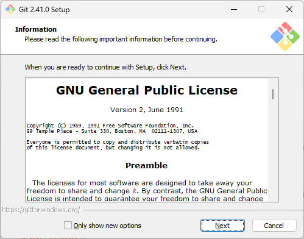
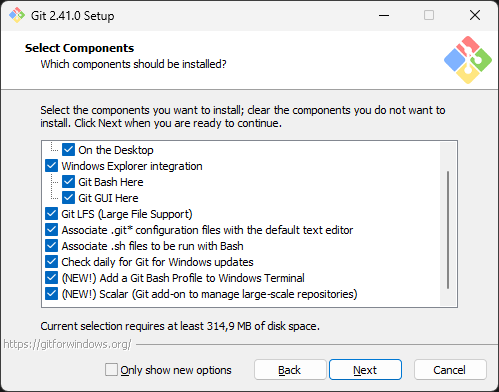
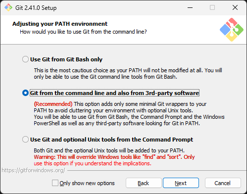
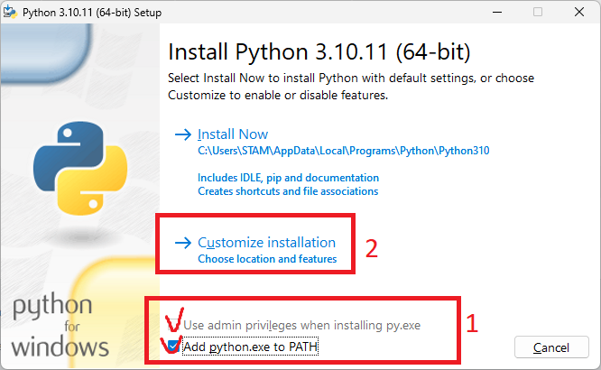
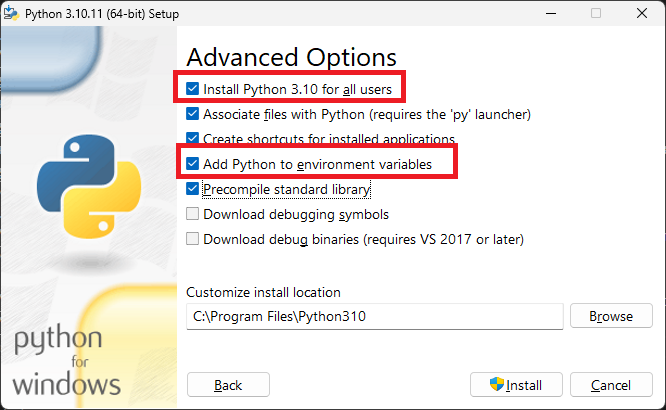

# Способы установки, обновления и запуска

Данный проект поддерживает исколючительно версию языка Python не выше 3.10. То есть, с Python 3.11 и выше он **НЕ СОВМЕСТИМ**.

# Windows
В данной инструкции рассматриваются только х64 битные версии Windows 10 и 11.
## Портативная версия со скриптами
### Прежде чем начать
Надо предварительно установить зависимости.
#### 1. Установите Git For Windows
* [Скачайте](https://git-scm.com/download/win) и начните установку git.
* 
* Если вы не знаете что отмечать, то оставьте настройки по умолчанию
* 
* В окне прописывания в PATH - лучше выбрать среднюю опцию, чтобы команды гита можно было вызывать из любого терминала.
* 
#### 2. Установите Visual Studio Community
* [Скачайте](https://visualstudio.microsoft.com/ru/downloads/) и установите Visual Studio Community.
* Ничего сложного, подойдут предлагаемые настройки по умолчанию.
#### 2. Установите Python 3.10.x Windows
* [Скачайте](https://www.python.org/ftp/python/3.10.11/python-3.10.11-amd64.exe) и начните установку Python [3.10.11](https://www.python.org/downloads/release/python-31011/).
* 
* Обязательно добавьте в переменные окружения (в PATH).
* 
### Установка
* Скачайте репозиторий, для этого откройте Командную строку (Терминал) в папке, где хотите разместить freegpt-webui-ru и напишите команду:
`git clone https://github.com/Em1tSan/freegpt-webui-ru.git`
* Откройте папку `freegpt-webui-ru` и запустите файл `install.bat`. Он создаст виртуальную среду и запустит установку зависимостей.
### Обновление
* Остановите запущеный процесс, если таковой есть.
* Откройте папку `freegpt-webui-ru` и запустите файл `update.bat`.
* Для запуска используйте `start.bat`.
### Запуск Чата
* Откройте папку `freegpt-webui-ru` и запустите файл `start.bat`. 
  * Перед запуском выполнится обновление.
  * Если хотите его отключить - откройте `start.bat` и удалите строку с `update`.
* Перейдите в браузере по адресу: `http://127.0.0.1:1338/`
### Запуск Endpoint'а (v1.3+)
* Откройте папку `freegpt-webui-ru` и запустите файл `start_endpoint.bat`. 
  * Перед запуском выполнится обновление.
  * Если хотите его отключить - откройте `start_endpoint.bat` и удалите строку с `update`.
* Endpoint будет доступен по адресу: `http://127.0.0.1:1337/`
## Портативная версия в виде EXE (только чат)
*К сожалению, из-за сборки в exe некоторые антивирусы выдают ложные срабатывания, поэтому если вас это смущает - воспользуйтесь альтернативной версией.*
* Зайдите в [раздел релизов](https://github.com/Em1tSan/FreeGPT/releases) и скачайте.
* Запустите скачанное приложение.
* Откроется бразуер по умолчанию с локальным адресом и портом. 
* Можно работать с чатом.
## Docker Desktop + WSL2
### Прежде чем начать
#### Способ 1. Локальная сборка
##### Установка
##### Обновление
#### Способ 2. Готовая сборка
##### Установка
##### Запуск
##### Обновление
## WSL2 Only
#### Прежде чем начать
#### Установка и обновления
* Перейдите в раздел Linux
## VirtualMachine
### Hyper-V
#### Прежде чем начать
#### Установка и обновления
* Перейдите в раздел Linux
### VirtualBox
#### Прежде чем начать
#### Установка и обновления
* Перейдите в раздел Linux


# Linux
* В данной инструкции рассматриваются только х64 битные версии Linux семейства Debian. Такие как Debian, Ubuntu, Mint и прочие.
* Так же следует учесть, в примерах рассматривается локальный запуск на линуксе. Но если у вас удаленная машина (или сервер), например, виртуальная - то ip-адрес будет отличаться от `127.0.0.1` в случае попытки доступа с соседнего (или внешнего) устройства.
## Docker + docker-compose (Рекоммендуется)
### Прежде чем начать
* Установите Docker в соответствии с вашим дистрибутивом. Выполняем в терминале:
* [Debian](https://docs.docker.com/engine/install/debian/):
  * `sudo apt-get update`
  * `sudo apt-get install ca-certificates curl gnupg`
  * `sudo install -m 0755 -d /etc/apt/keyrings`
  * `curl -fsSL https://download.docker.com/linux/ubuntu/gpg | sudo gpg --dearmor -o /etc/apt/keyrings/docker.gpg`
  * `sudo chmod a+r /etc/apt/keyrings/docker.gpg`
  * `echo "deb [arch="$(dpkg --print-architecture)" signed-by=/etc/apt/keyrings/docker.gpg] https://download.docker.com/linux/debian  "$(. /etc/os-release && echo "$VERSION_CODENAME")" stable" | sudo tee /etc/apt/sources.list.d/docker.list > /dev/null`
  * `sudo apt-get update`
  * `sudo apt-get install docker-ce docker-ce-cli containerd.io docker-buildx-plugin docker-compose-plugin`
* [Ubuntu](https://docs.docker.com/engine/install/ubuntu/), [Mint](https://docs.docker.com/engine/install/ubuntu/):
  * `sudo apt-get update`
  * `sudo apt-get install ca-certificates curl gnupg`
  * `sudo install -m 0755 -d /etc/apt/keyrings`
  * `curl -fsSL https://download.docker.com/linux/ubuntu/gpg | sudo gpg --dearmor -o /etc/apt/keyrings/docker.gpg`
  * `sudo chmod a+r /etc/apt/keyrings/docker.gpg`
  * `echo "deb [arch="$(dpkg --print-architecture)" signed-by=/etc/apt/keyrings/docker.gpg] https://download.docker.com/linux/ubuntu "$(. /etc/os-release && echo "$VERSION_CODENAME")" stable" | sudo tee /etc/apt/sources.list.d/docker.list > /dev/null`
  * `sudo apt-get update`
  * `sudo apt-get install docker-ce docker-ce-cli containerd.io docker-buildx-plugin docker-compose-plugin`

Теперь остается выбрать, какой вариант docker-compose использовать
### Вариант 1. docker-compose с локальной сборкой
#### Установка
* Скачайте freegpt-webui: `git clone https://github.com/Em1tSan/freegpt-webui-ru`.
* Откройте папку freegpt-webui-ru: `cd freegpt-webui-ru`.
* Выполните сборку `docker-compose build`
#### Обновление
* Откройте папку freegpt-webui-ru: `cd freegpt-webui-ru`.
* Остановите котнейнер, если запущен: `docker-compose down freegpt-neurogen`
* Скачайте обновления freegpt-webui, выполнив команды: `git reset --hard` и `git pull`
* Выполните пересборку `docker-compose build`
* Можно запускать  `docker-compose up -d --force-recreate freegpt-neurogen`
  * `-d` Параметр выполнит запуск в фоне. Если хотите вывод в консоль терминала - не добавляйте этот аргумент.
  * `freegpt-neurogen` - заданное имя контейнера в файле `docker-compose.yml`.
  * `--force-recreate` - принудительно пересоздает контейнер из последних слоев образа. Помогает, если после пересборки контейнера почему-то не хочет обновляться.
#### Запуск
* Выполните `docker-compose up -d --force-recreate freegpt-neurogen`
  * `-d` Параметр выполнит запуск в фоне. Если хотите вывод в консоль терминала - не добавляйте этот аргумент.
  * `freegpt-neurogen` - заданное имя контейнера в файле `docker-compose.yml`.
  * `--force-recreate` - принудительно пересоздает контейнер из последних слоев образа.
* Откройте страницу в браузере: `http://127.0.0.1:1338/`
### Вариант 2. [Сторонний готовый образ](https://github.com/EpicMorg/docker/tree/master/linux/ecosystem/freegpt-webui) и docker-compose к  нему
* *Подержкой этого решения занимается внешний разработчик и подписчик канала, способ официальным не является.*
* В данном варианте - ничего собирать и качать из гита не надо. Достаточно заполнить файл манифеста `docker-compose.yml` как надо и будет работать. Поддерживаемые версии: все, в соотвествии со страницей релизов. С версии `1.3` появилась поддержка endpoint-ов. 
#### Установка
* В удобном месте создайте файл `docker-compose.yml`
  * Пример файла `docker-compose.yml`
    ```yml
    version: "3.9"
    services:
      freegpt-neurogen:
        image: epicmorg/freegpt-webui:latest
        container_name: freegpt-neurogen
        hostname: freegpt-neurogen
        restart: always
        ports:
           - 1337:1337
           - 1338:1338
    ```
  * Версии которые можно указать: `latest`, `1.4`, `1.3.2`, `1.3.1`, `1.3`, `1.2`, `1.1`, `1.0`
* Находясь рядом с файлом, скачайте образ: `docker-compose pull freegpt-neurogen`
* Можно запускать.
#### Обновление
* Откройте папку сождержащую ваш файл `docker-compose.yml`
* Остановите котнейнер, если запущен: `docker-compose down freegpt-neurogen`
* Отредактируйте файл `docker-compose.yml` указав версию нового релиза.
  * В случае, если указан `latest` - то ничего редактировать не надо. Шаг можно пропустить.
* Скачайте обновления выполнив команду: `docker-compose pull freegpt-neurogen`
* Можно запускать.
#### Запуск
* Выполните `docker-compose up -d --force-recreate freegpt-neurogen`
  * `-d` Параметр выполнит запуск в фоне. Если хотите вывод в консоль терминала - не добавляйте этот аргумент.
  * `freegpt-neurogen` - заданное имя контейнера в файле `docker-compose.yml`.
  * `--force-recreate` - принудительно пересоздает контейнер из последних слоев образа.
* Откройте страницу в браузере: `http://127.0.0.1:1338/`
* Начиная с версии 1.3 и выше - параллельно чату вам так же будет доступен и endpoint `http://127.0.0.1:1337/`

## Ручная установка (не рекоммендуется)
**Внимание!** Наличие совместимой версии Python для установки из репозитория очень сильно зависит от вашего дистрибутива! Например, в `Debian 12` поставляется с `Python 3.11`. 
### Прежде чем начать
Надо установить зависимости, если они не установлены. Выполняем в терминале:
* `sudo apt update`
* `sudo apt install python3-full python-is-python3 git`
* `sudo apt install build-essential libffi-dev cmake libcurl4-openssl-dev`
### Установка
* Скачайте freegpt-webui: `git clone https://github.com/Em1tSan/freegpt-webui-ru`.
* Откройте папку freegpt-webui-ru: `cd freegpt-webui-ru`
* Выполните установку необходимых пакетов: `pip install -r requirements.txt`
### Запуск Чата
* Откройте папку `freegpt-webui-ru`. 
* Выполните `python3 run.py`
* Если все в порядке, то после запуска, можете открыть в браузере адрес: `http://127.0.0.1:1338/`
### Запуск Endpoint'а (v1.3+)
* Откройте папку `freegpt-webui-ru`. 
* Выполните `python3 endpoint.py`
* Endpoint будет доступен по адресу: `http://127.0.0.1:1337/`

### Обновление
# MacOS
* wip
